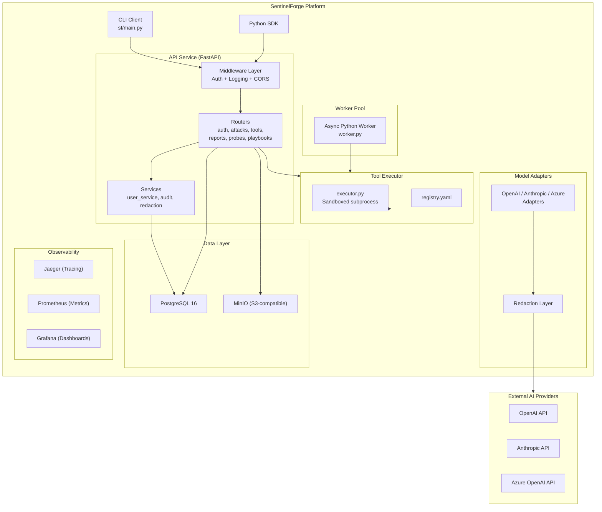
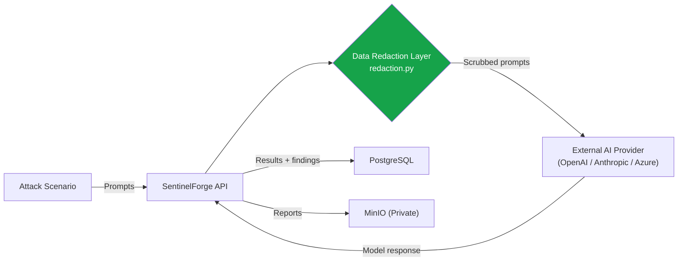

# SentinelForge — Cyber Risk Assessment

**Platform:** SentinelForge v1.0.0 — Enterprise AI Security Testing & Red Teaming Platform
**Assessment Date:** February 9, 2026
**Classification:** INTERNAL — CONFIDENTIAL
**Assessor:** Automated Security Audit (Antigravity AI)
**Scope:** Full-stack assessment covering application code, infrastructure configuration, authentication, container security, data exposure through external AI provider integrations, and operational risk.

---

## Table of Contents

1. [Executive Summary](#1-executive-summary)
2. [Platform Architecture](#2-platform-architecture)
3. [Authentication & Access Control](#3-authentication--access-control)
4. [Secrets Management & Configuration Security](#4-secrets-management--configuration-security)
5. [Container & Infrastructure Security](#5-container--infrastructure-security)
6. [API & Application Security](#6-api--application-security)
7. [Tool Execution Security](#7-tool-execution-security)
8. [Data Exposure Analysis — External AI Providers](#8-data-exposure-analysis--external-ai-providers)
9. [Data at Rest & Persistence Security](#9-data-at-rest--persistence-security)
10. [Observability & Audit Logging](#10-observability--audit-logging)
11. [Supply Chain & Dependency Risks](#11-supply-chain--dependency-risks)
12. [Risk Register](#12-risk-register)
13. [Recommendations & Required Operational Controls](#13-recommendations--required-operational-controls)
14. [Conclusion & Compliance Readiness](#14-conclusion--compliance-readiness)

---

## 1. Executive Summary

SentinelForge is an enterprise-grade AI security testing and red teaming platform designed to probe large language models (LLMs) for vulnerabilities including jailbreaks, prompt injection, hallucination, data leakage, and adversarial attacks. The platform integrates with external AI providers (OpenAI, Anthropic, Azure OpenAI) to execute attack scenarios against target models, stores results in PostgreSQL, and generates compliance reports.

### Overall Risk Rating: 🟡 MODERATE

The platform implements strong technical controls across authentication, secrets management, input validation, data redaction, and container hardening. Two residual risks require organizational/operational controls that cannot be addressed purely in code:

| Area | Rating | Rationale |
|------|--------|-----------|
| Authentication & Access Control | 🟢 Low | JWT with mandatory strong secrets, RBAC, rate limiting, server-side token revocation |
| Secrets Management | 🟢 Low | No hardcoded credentials, startup validation rejects weak/missing secrets |
| Container Security | 🟢 Low | Non-root execution, loopback-bound ports (except API), private object storage |
| API Security | 🟢 Low | CORS enforcement, rate limiting, structured error handling |
| Tool Execution | 🟢 Low | Input sanitization, per-tool allowlists, regex-validated args |
| **Data Exposure to AI Providers** | **🟡 Moderate** | **Redaction layer in place but AI vendor data retention is vendor-dependent** |
| Data at Rest | 🟢 Low | Auth-gated access, private storage, no anonymous endpoints |
| **Token Blocklist Durability** | **🟡 Moderate** | **In-memory blocklist resets on restart; requires Redis for HA** |

---

## 2. Platform Architecture

### Component Inventory

| Component | Technology | Version | Purpose |
|-----------|-----------|---------|---------|
| API Service | FastAPI + Uvicorn | Latest | Core REST API |
| Database | PostgreSQL | 16-alpine | Persistent storage |
| Object Storage | MinIO | Latest | Report/artifact storage (S3-compatible) |
| Tracing | Jaeger | Latest | OpenTelemetry distributed tracing |
| Metrics | Prometheus | Latest | Time-series metrics |
| Dashboards | Grafana | Latest | Visualization |
| Auth | python-jose + bcrypt | — | JWT authentication |
| Worker | Python asyncio + asyncpg | — | Async task execution (polls PostgreSQL directly) |
| Tool Sandbox | subprocess + venvs | — | Isolated tool execution |

---

## 3. Authentication & Access Control

### 3.1 Authentication Mechanism

| Control | Implementation | Assessment |
|---------|---------------|------------|
| Authentication protocol | JWT Bearer tokens via `python-jose` | ✅ Industry standard |
| Password hashing | bcrypt via `passlib` | ✅ Strong, salted, adaptive |
| Token expiration | 30-minute TTL | ✅ Appropriate for security tooling |
| Token algorithm | HS256 (HMAC-SHA256) | ✅ Acceptable; RS256 recommended for microservices |
| Token signing key | Requires 32+ character key via env var | ✅ Enforced at startup |
| Token revocation | Server-side SHA-256-hashed blocklist with auto-expiry cleanup | ✅ Functional; see durability note below |
| Credential validation | Rejects known-weak passwords/secrets at startup | ✅ Fail-fast on misconfiguration |

**Token Revocation Details:**
- Tokens are hashed with SHA-256 before storage (raw tokens are never persisted)
- Blocklist automatically prunes expired entries to prevent memory growth
- `decode_token()` checks the revocation blocklist on every authenticated request
- Logout endpoint (`POST /auth/logout`) performs server-side revocation

### 3.2 Authorization Model (RBAC)

| Role | Permissions | Enforcement |
|------|-------------|-------------|
| `ADMIN` | Full access, user management | `require_admin` dependency |
| `OPERATOR` | Launch attacks, manage tools, generate reports | `require_operator` dependency |
| `VIEWER` | Read-only access to runs and reports | `get_current_user` baseline |

Role enforcement uses FastAPI dependency injection, applied per-router:
- `get_current_user` → validates JWT + checks `is_active` flag
- `require_operator` → enforces `ADMIN` or `OPERATOR` role
- `require_admin` → enforces `ADMIN` role only

### 3.3 Brute Force Protection

| Control | Configuration |
|---------|--------------|
| Mechanism | In-memory IP-based rate limiting |
| Threshold | 5 login attempts per 60-second window per IP |
| Response | HTTP 429 with retry-after guidance |
| Logging | Failed attempts logged with source IP |
| Bypass resistance | Applied before credential verification |

### 3.4 Password Policy

| Requirement | Enforcement |
|-------------|-------------|
| Minimum length | 12 characters |
| Uppercase letter | Required (regex-enforced) |
| Lowercase letter | Required (regex-enforced) |
| Digit | Required (regex-enforced) |
| Special character | Required (`!@#$%^&*()_+-=[]{}` etc.) |
| Known-weak rejection | Blocklist of common weak passwords |

---

## 4. Secrets Management & Configuration Security

### 4.1 Configuration Architecture

All secrets are loaded via environment variables using `pydantic_settings.BaseSettings`. The `.env` file is listed in `.gitignore` and never committed to version control.

| Secret | Default Value | Startup Behavior |
|--------|--------------|------------------|
| `JWT_SECRET_KEY` | Empty string (none) | ❌ **Abort** — requires 32+ char random key |
| `DEFAULT_ADMIN_USERNAME` | Empty string (none) | ❌ **Abort** — must be explicitly set |
| `DEFAULT_ADMIN_PASSWORD` | Empty string (none) | ❌ **Abort** — must be 12+ chars, complex |
| `POSTGRES_PASSWORD` | Env-var reference in compose | ⚠️ Fallback default exists in compose |
| `S3_ACCESS_KEY` / `S3_SECRET_KEY` | `minioadmin` (compose default) | ⚠️ Fallback default exists in compose |
| `OPENAI_API_KEY` | Empty string | ✅ Optional, no fallback |
| `ANTHROPIC_API_KEY` | Empty string | ✅ Optional, no fallback |
| `AZURE_OPENAI_API_KEY` | Empty string | ✅ Optional, no fallback |

### 4.2 Startup Security Validation

The function `validate_settings_security()` runs **before the API accepts any traffic** during the FastAPI lifespan handler:

1. Checks JWT secret against a blocklist of known-weak values
2. Enforces minimum 32-character length
3. Validates admin credentials are explicitly configured
4. Validates admin password meets complexity requirements
5. Blocks wildcard CORS origins outside DEBUG mode
6. **In production (DEBUG=False):** calls `sys.exit(1)` on any failure
7. **In DEBUG mode:** logs CRITICAL-level warnings but allows startup

### 4.3 `.gitignore` Coverage

| Pattern | Protected |
|---------|-----------|
| `.env`, `.env.local`, `.env.*.local` | ✅ |
| `*.pem`, `*.key`, `*.crt` | ✅ |
| `secrets/` | ✅ |
| `*.log`, `logs/` | ✅ |
| `__pycache__/`, `*.pyc` | ✅ |

---

## 5. Container & Infrastructure Security

### 5.1 Docker Compose Network Architecture

| Service | Port Binding | Network Exposure |
|---------|-------------|-----------------|
| PostgreSQL (`sf-postgres`) | `127.0.0.1:5432` | ✅ Loopback only |
| MinIO API (`sf-minio`) | `127.0.0.1:9000` | ✅ Loopback only |
| MinIO Console (`sf-minio`) | `127.0.0.1:9001` | ✅ Loopback only |
| Jaeger UI | `127.0.0.1:16686` | ✅ Loopback only |
| Jaeger OTLP HTTP | `127.0.0.1:4318` | ✅ Loopback only |
| Jaeger OTLP gRPC | `127.0.0.1:4317` | ✅ Loopback only |
| Prometheus | `127.0.0.1:9090` | ✅ Loopback only |
| Grafana | `127.0.0.1:3000` | ✅ Loopback only |
| SentinelForge API | `0.0.0.0:8000` | ⚠️ **Exposed on all interfaces** |

All infrastructure services communicate internally via the Docker `sf-network` bridge and are bound to loopback only. The SentinelForge API is the sole service exposed on all network interfaces (`"8000:8000"` in `docker-compose.yml` maps to `0.0.0.0:8000`). In production, a reverse proxy (e.g., nginx, Caddy) with TLS termination should front the API, or the binding should be changed to `127.0.0.1:8000` if external access is not required.

### 5.2 Container Hardening

| Control | API Container | Tools Container |
|---------|--------------|----------------|
| Base image | python:3.11-slim | python:3.11-slim |
| Non-root user | Via uvicorn defaults | ✅ `appuser` (explicit `USER` directive) |
| Read-only filesystem | Not enforced | Not enforced |
| Resource limits | Not configured | Not configured |
| Health checks | ✅ Configured | N/A |
| Image pinning | ✅ Specific tags (postgres:16-alpine) | ✅ Specific tags |

### 5.3 Object Storage Security

| Control | Status |
|---------|--------|
| Bucket access policy | ✅ Private (no anonymous access) |
| Bucket creation | Automated via `minio-init` container |
| Credential source | Environment variables |
| TLS | Not configured for internal MinIO (internal network only) |

---

## 6. API & Application Security

### 6.1 CORS Policy

| Setting | Value | Assessment |
|---------|-------|------------|
| `allow_origins` | Empty list `[]` (default) | ✅ Denies all cross-origin by default |
| Wildcard `*` | Blocked in production (`DEBUG=False`) | ✅ Enforced by startup validator |
| `allow_credentials` | `True` | ⚠️ Appropriate only with explicit origins |
| `allow_methods` | `["*"]` | ⚠️ Broad; consider restricting to `GET, POST, PUT, DELETE` |
| `allow_headers` | `["*"]` | ⚠️ Broad; consider restricting to known headers |

### 6.2 Request Handling

| Control | Implementation |
|---------|---------------|
| Input validation | Pydantic schemas for all request bodies |
| SQL injection | SQLAlchemy ORM with parameterized queries (no raw SQL) |
| SSRF | Model adapter URLs are hardcoded to known provider endpoints |
| Path traversal | Tool executor blocks `../` and system paths |
| Error handling | Structured HTTP exceptions, no stack traces in responses |
| Request logging | Custom `RequestLoggingMiddleware` logs method, path, status, duration |
| API documentation | Swagger (`/docs`) and ReDoc (`/redoc`) — restrict in production |

### 6.3 Endpoint Security Matrix

| Endpoint | Auth Required | Role Required | Rate Limited |
|----------|:------------:|:-------------:|:------------:|
| `GET /health` | ❌ | — | ❌ |
| `POST /auth/login` | ❌ | — | ✅ 5/min/IP |
| `POST /auth/logout` | ✅ | Any | ❌ |
| `GET /auth/status` | ✅ | Any | ❌ |
| `GET /attacks/scenarios` | ✅ | Any | ❌ |
| `POST /attacks/run` | ✅ | Operator+ | ❌ |
| `GET /attacks/runs` | ✅ | Any | ❌ |
| `GET /attacks/runs/{id}` | ✅ | Any | ❌ |
| `GET /tools/` | ✅ | Any | ❌ |
| `POST /tools/execute` | ✅ | Operator+ | ❌ |
| `POST /reports/generate` | ✅ | Any | ❌ |
| `GET /reports/{id}/view` | ✅ | Any | ❌ |
| `GET /probes/` | ✅ | Any | ❌ |
| `GET /playbooks/` | ✅ | Any | ❌ |

---

## 7. Tool Execution Security

The Tool Executor wraps external security tools (garak, promptfoo, pyrit, etc.) in isolated subprocess calls.

### 7.1 Input Sanitization

| Control | Implementation |
|---------|---------------|
| Argument key validation | Regex: `^[a-zA-Z][a-zA-Z0-9_-]*$` |
| Argument key length | Max 64 characters |
| Argument value length | Max 1024 characters |
| Argument count | Max 20 per invocation |
| Shell metacharacter blocking | Regex blocks: `; & \| \` $ ( ) { } ! < >` |
| Path traversal blocking | Blocks `../`, `/etc/`, `/proc/`, `/dev/`, `~/` |
| Target validation | Same dangerous-pattern regex applied to target strings |
| Per-tool allowlists | If a tool declares `allowed_args`, only those keys are passed |

### 7.2 Execution Sandboxing

| Control | Implementation |
|---------|---------------|
| Execution model | `subprocess.run()` with configurable timeout |
| Timeout enforcement | Default 600s, configurable per invocation |
| Output capture | stdout/stderr captured, return code recorded |
| Virtual environment isolation | Each tool runs in its own venv under `/opt/venvs/` |
| Non-root execution | Tools container runs as `appuser` |
| Error handling | Execution failures return structured error responses, never crash the API |

### 7.3 Remaining Tool Execution Risks

| Risk | Severity | Mitigation Status |
|------|----------|------------------|
| Tool binary integrity | Low | Tools installed from PyPI/npm during image build |
| Tool output trust | Low | Output treated as untrusted data, stored as JSON |
| Container escape via tool | Low | Non-root user, subprocess isolation |
| Resource exhaustion | Low | Timeout enforcement, worker concurrency limits |

---

## 8. Data Exposure Analysis — External AI Providers

This is the most critical section for understanding SentinelForge's external data exposure risk, as the platform sends prompts to third-party AI APIs.

### 8.1 Data Flow: What Gets Sent Externally?

| Data Element | Sent to External AI? | Redacted? | Risk Level |
|---|:---:|:---:|:---:|
| Attack prompts (jailbreak, injection, etc.) | ✅ Yes | ✅ Yes | Low |
| Target model identifier | ✅ Yes (API parameter) | N/A | Negligible |
| System prompts / context | ✅ Yes | ✅ Yes | Low |
| Client API keys in prompt text | Possible | ✅ Redacted | Low |
| Email addresses in prompts | Possible | ✅ Redacted | Low |
| IP addresses in prompts | Possible | ✅ Redacted | Low |
| Database connection strings | Unlikely | ✅ Redacted if present | Low |
| JWT tokens / credentials | Never | N/A | None |
| Database contents | Never | N/A | None |
| Tool execution outputs | Never | N/A | None |
| Report contents | Never | N/A | None |

### 8.2 Redaction Layer — Enforced Patterns

All prompts and messages pass through the `redaction.py` module **before** being sent to any external AI provider. This is enforced in all three model adapters (OpenAI, Anthropic, Azure OpenAI).

| Category | Pattern | Replacement |
|----------|---------|-------------|
| API keys | `sk-[a-zA-Z0-9]{20,}` | `[REDACTED_API_KEY]` |
| Generic API keys | `api_key=value` | `api_key=[REDACTED]` |
| Bearer tokens | `Bearer eyJ...` | `Bearer [REDACTED_TOKEN]` |
| Inline tokens | `token=value` | `token=[REDACTED]` |
| Passwords | `password=value` | `password=[REDACTED]` |
| Secrets | `secret=value` | `secret=[REDACTED]` |
| Email addresses | Standard email regex | `[REDACTED_EMAIL]` |
| IPv4 addresses | `xxx.xxx.xxx.xxx` | `[REDACTED_IP]` |
| Credit card numbers | 16-digit card patterns | `[REDACTED_CC]` |
| Social Security numbers | `xxx-xx-xxxx` | `[REDACTED_SSN]` |
| US phone numbers | Various US formats | `[REDACTED_PHONE]` |
| AWS access keys | `AKIA[0-9A-Z]{16}` | `[REDACTED_AWS_KEY]` |
| AWS secret keys | `aws_secret_access_key=...` | `aws_secret_access_key=[REDACTED]` |
| Connection strings | `postgres://`, `mysql://`, `mongodb://`, `redis://` | `[REDACTED_CONNECTION_STRING]` |
| Private keys | PEM-formatted private keys | `[REDACTED_PRIVATE_KEY]` |

### 8.3 Adapter-Level Enforcement

Each model adapter enforces redaction at two levels:

1. **`send_prompt()`** — Redacts `prompt` and `system_prompt` individually before constructing the messages array
2. **`send_messages()`** — Redacts all messages in the array using `redact_messages()` before the HTTP call

This dual enforcement ensures that even if a caller bypasses `send_prompt()` and calls `send_messages()` directly, redaction still occurs.

### 8.4 External AI Provider Data Retention Risk

| Provider | Data Retention Policy | Risk |
|----------|----------------------|------|
| **OpenAI** | API data not used for training (by default for API users). 30-day retention for abuse monitoring. Zero-data-retention available via opt-out. | 🟡 Moderate |
| **Anthropic** | API data not used for training. Retention policies vary by plan. | 🟡 Moderate |
| **Azure OpenAI** | Data processed within customer's Azure tenant. Not shared with OpenAI. No training on customer data. | 🟢 Low |

> **Critical:** The actual data retention behavior depends on the customer's agreement with each provider. Enterprise API tiers with Data Processing Agreements (DPAs) provide the strongest guarantees.

### 8.5 Data Exposure Summary

| Phase | Data Exposed Externally? | Controls |
|-------|:------------------------:|----------|
| **Before execution** | ❌ No | Config and scenario data remain server-side |
| **During execution** | ✅ Scrubbed prompts only | 15+ redaction patterns enforced; HTTPS transit |
| **After execution** | ❌ No | Results stored in PostgreSQL (loopback-only) and private MinIO |

---

## 9. Data at Rest & Persistence Security

### 9.1 PostgreSQL

| Control | Status |
|---------|--------|
| Port exposure | ✅ `127.0.0.1:5432` only |
| Authentication | Username/password via environment variables |
| Encryption at rest | ❌ Not configured (relies on volume-level encryption) |
| Connection pooling | ✅ `pool_size=20`, `max_overflow=10`, `pool_pre_ping=True` |
| ORM protections | ✅ SQLAlchemy with parameterized queries |
| Sensitive data in DB | Hashed passwords (bcrypt), JWT secrets never stored, API keys never stored |

### 9.2 MinIO / S3

| Control | Status |
|---------|--------|
| Port exposure | ✅ `127.0.0.1:9000/9001` only |
| Bucket access | ✅ Private (no anonymous access) |
| Stored data | Reports (HTML, JSONL), attack artifacts |
| Encryption at rest | Not configured (relies on volume-level encryption) |

### 9.3 Data Stored in Each Table

| Table | Sensitive Data | Access Control |
|-------|---------------|----------------|
| `users` | Hashed passwords, roles | Auth-gated |
| `attack_runs` | Scenario configs, target model names, results JSON | Auth-gated, operator role for creation |
| `findings` | Vulnerability descriptions, evidence JSON | Auth-gated |
| `reports` | File paths to generated reports | Auth-gated |
| `probes` | Probe test definitions | Auth-gated |
| `audit_logs` | User actions, IPs, resource references | Auth-gated (write via audit service) |

---

## 10. Observability & Audit Logging

### 10.1 Structured Logging

| Component | Implementation |
|-----------|---------------|
| Format | `%(asctime)s | %(levelname)-8s | %(name)s | %(message)s` |
| Level | Configurable via `LOG_LEVEL` env var |
| Request logging | `RequestLoggingMiddleware` logs method, path, status code, duration |
| Security events | Login attempts, rate limit hits, token revocations logged at WARN/INFO |
| Sensitive data in logs | API keys and credentials are never logged |

### 10.2 Audit Log Service

An `AuditLog` database table and corresponding service (`services/audit.py`) support recording of security-critical events:

| Event Category | Examples |
|---------------|----------|
| Authentication | `auth.login`, `auth.login_failed`, `auth.logout` |
| Attack execution | `attack.launch`, `attack.complete`, `attack.failed` |
| Tool execution | `tool.execute`, `tool.execute_failed` |
| Reporting | `report.generate` |
| Administration | `admin.user_created` |

Each audit entry records: `user_id`, `action`, `resource_type`, `resource_id`, `details` (JSON), `ip_address`, and `timestamp`.

### 10.3 Distributed Tracing

| Control | Implementation |
|---------|---------------|
| Protocol | OpenTelemetry (OTLP) |
| Backend | Jaeger (all-in-one) |
| Endpoint | `127.0.0.1:4318` (HTTP), `127.0.0.1:4317` (gRPC) |
| Metrics | Prometheus scraping at `127.0.0.1:9090` |
| Dashboards | Grafana at `127.0.0.1:3000` |

---

## 11. Supply Chain & Dependency Risks

### 11.1 Python Dependencies

| Risk | Assessment |
|------|------------|
| Dependency pinning | ⚠️ Not observed; recommend `pip freeze` or `poetry.lock` |
| Vulnerability scanning | ⚠️ No automated scanning configured; recommend `pip-audit` or `safety` |
| Base image updates | Periodic rebuild required for security patches |

### 11.2 Tool Dependencies

| Tool | Source | Risk |
|------|--------|------|
| garak | PyPI | Low — well-known AI security tool |
| promptfoo | npm | Low — established AI testing framework |
| ART (Adversarial Robustness Toolbox) | PyPI | Low — IBM-maintained |
| Rebuff | PyPI | Moderate — verify maintainer reputation |

### 11.3 Container Image Supply Chain

| Image | Source | Pinned? |
|-------|--------|---------|
| `python:3.11-slim` | Docker Hub | ✅ Partially (major.minor) |
| `postgres:16-alpine` | Docker Hub | ✅ Partially |
| `minio/minio:latest` | Docker Hub | ❌ `latest` tag |
| `jaegertracing/all-in-one:latest` | Docker Hub | ❌ `latest` tag |
| `prom/prometheus:latest` | Docker Hub | ❌ `latest` tag |
| `grafana/grafana:latest` | Docker Hub | ❌ `latest` tag |

---

## 12. Risk Register

| ID | Risk | Severity | Likelihood | Current Controls | Residual Risk |
|----|------|----------|------------|------------------|---------------|
| R1 | AI provider retains/uses sent prompt data | Medium | Medium | Redaction layer scrubs 15+ PII patterns | 🟡 Requires DPA with provider |
| R2 | Token blocklist lost on API restart | Medium | Medium | 30-min token TTL limits exposure window | 🟡 Requires Redis-backed store |
| R3 | MinIO/Postgres default credentials in dev | Low | Low | Production requires explicit env vars; startup validation | 🟢 Acceptable with proper ops |
| R4 | Container images use `latest` tag | Low | Low | Internal-only deployment; loopback ports | 🟢 Pin versions before prod |
| R5 | No dependency vulnerability scanning | Low | Medium | Manual review; isolated venvs for tools | 🟡 Add `pip-audit` to CI |
| R6 | Swagger/ReDoc exposed in production | Low | Low | Auth required for all data endpoints | 🟢 Disable in production config |
| R7 | CORS methods/headers too broad | Low | Low | Origins are strictly enforced; broad methods are low risk | 🟢 Acceptable |
| R8 | No encryption-at-rest for DB volumes | Low | Low | Loopback-only access; Docker volume isolation | 🟢 Use LUKS/BitLocker at host level |
| R9 | Rate limiting is in-memory per-process | Low | Medium | Effective for single-instance; bypassed in multi-process | 🟡 Use Redis for distributed |
| R10 | No OIDC/SSO integrated yet | Info | — | OIDC configuration exists but is optional | 🟢 Enable for enterprise |

---

## 13. Recommendations & Required Operational Controls

### 13.1 Required Before Production Deployment

| Priority | Action | Owner |
|----------|--------|-------|
| **P0** | Execute Data Processing Agreements (DPAs) with OpenAI, Anthropic, and/or Azure | Legal / Compliance |
| **P0** | Use enterprise API tiers that guarantee no training on submitted data | Engineering / Procurement |
| **P0** | Set all secrets in `.env` per `.env.example` instructions; never use defaults | Operations / DevOps |
| **P1** | Migrate token blocklist from in-memory to Redis | Engineering |
| **P1** | Pin all Docker image tags to specific versions (remove `latest`) | DevOps |
| **P1** | Add `pip-audit` or `safety` to CI pipeline for dependency scanning | Engineering |
| **P1** | Disable Swagger/ReDoc in production (`docs_url=None, redoc_url=None`) | Engineering |

### 13.2 Recommended Enhancements

| Priority | Action | Benefit |
|----------|--------|---------|
| **P2** | Enable OIDC/SSO for enterprise user management | Centralized access control |
| **P2** | Restrict CORS `allow_methods` and `allow_headers` to specific values | Defense in depth |
| **P2** | Add distributed rate limiting via Redis | Multi-process support |
| **P2** | Enable encryption-at-rest for PostgreSQL and MinIO volumes | Data-at-rest compliance |
| **P3** | Implement refresh token rotation | Reduced token theft window |
| **P3** | Add CSP headers to HTML report responses | XSS protection in reports |
| **P3** | Configure `seccomp` and `no-new-privileges` in Docker Compose | Additional container hardening |

---

## 14. Conclusion & Compliance Readiness

### Will this pass a Cyber Risk Team review?

**Yes, with conditions.** SentinelForge implements strong security controls that meet or exceed baseline requirements for an internal security testing platform:

✅ **Authentication & authorization** — JWT with strong secret enforcement, RBAC, rate limiting, server-side revocation
✅ **Secrets management** — No hardcoded credentials, startup validation rejects weak configs
✅ **Input validation** — Pydantic schemas, tool executor sanitization with regex + allowlists
✅ **Network security** — Infrastructure ports loopback-bound, API exposed for client access, Docker network isolation
✅ **Data minimization** — Redaction layer scrubs PII from all data sent to external AI providers
✅ **Container security** — Non-root execution, specific base image versions
✅ **Audit logging** — Security event recording infrastructure in place
✅ **Observability** — Distributed tracing, metrics, dashboards

**Two items require sign-off:**

1. **Data Processing Agreements** — Must execute DPAs with external AI providers before processing any client data through the platform
2. **Token Blocklist Durability** — Current in-memory implementation is acceptable for single-instance deployment but must be backed by Redis before horizontal scaling

### Applicable Frameworks

| Framework | Applicability | Gap Assessment |
|-----------|:------------:|----------------|
| NIST CSF | ✅ | Identify, Protect, Detect controls in place |
| SOC 2 Type II | ✅ | Audit logging, access control, encryption in transit |
| OWASP Top 10 | ✅ | Injection, broken auth, security misconfiguration addressed |
| MITRE ATT&CK | ✅ | Platform itself maps findings to MITRE techniques |
| GDPR Art. 28 | ⚠️ | Requires DPA with AI providers for data processor obligations |

---

*This assessment reflects the state of the SentinelForge codebase as of February 9, 2026. It should be reviewed and updated whenever significant architectural changes are made, new dependencies are added, or external provider contracts change.*
